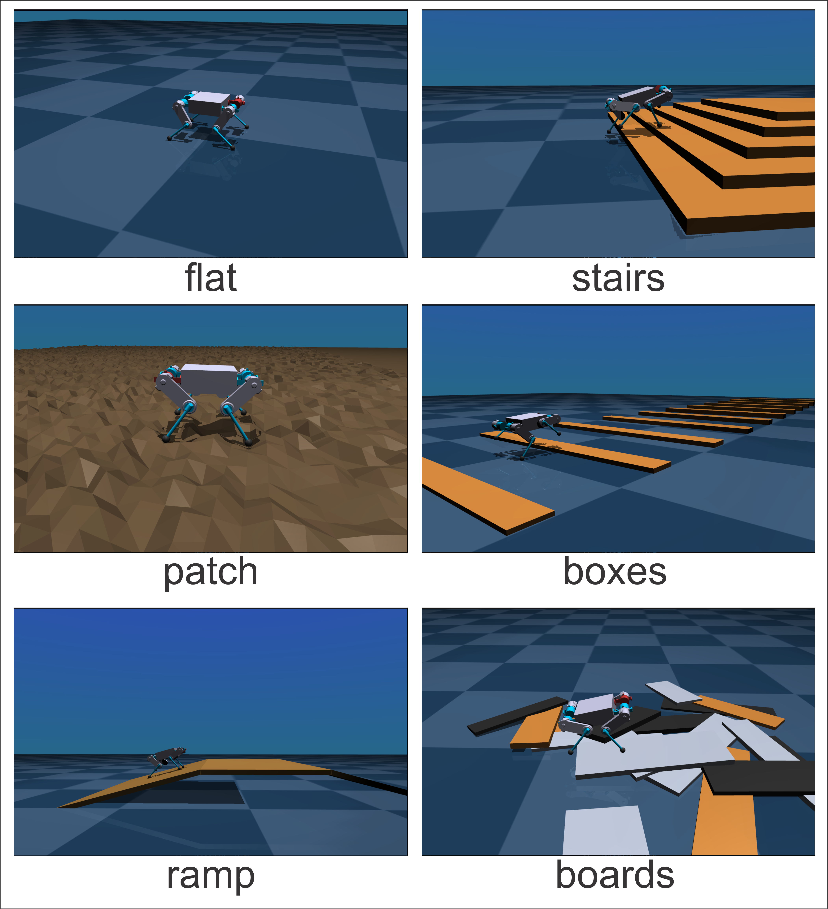

# MORS Quadruped Robot Control

This repository contains the basic control stack for the [MORS](https://docs.voltbro.ru/mors/) quadruped robot, using an MPC/WBIC controller. [MuJoCo](https://mujoco.org/) is used for simulation. Commands can be sent through the ROS 2 `keyboard_teleop` interface.

Click on the picture below to watch the video:

[](https://youtu.be/28EshOERJ94?si=7QsEtfh_oUpAAv3s)

The control algorithm is based on the following publications:

- Di Carlo, Jared, et al. "Dynamic locomotion in the mit cheetah 3 through convex model-predictive control." 2018 IEEE/RSJ international conference on intelligent robots and systems (IROS). IEEE, 2018. [Link](https://dspace.mit.edu/handle/1721.1/138000)

- Kim, Donghyun, et al. "Highly dynamic quadruped locomotion via whole-body impulse control and model predictive control." arXiv preprint arXiv:1909.06586, 2019. [Link](https://arxiv.org/abs/1909.06586)


## Requirements

- Ubuntu 24.x
- [ROS 2 Jazzy](https://docs.ros.org/en/jazzy/index.html) (`/opt/ros/jazzy`)
- `sudo` access

## Quick Start

### Installation

```bash
cd ~
git clone https://github.com/voltdog/mors_quadruped.git
cd mors_quadruped
chmod +x install.sh start_controller.sh
./install.sh
source ~/.bashrc
```

### Launch

Start the simulator together with the locomotion controller:

```bash
./start_controller.sh --sim
```

Start with the logger enabled:

```bash
./start_controller.sh --sim --log
```

After launch, wait until the following message appears in the console:
```
[LocomotionController]: Started
```

Then run the following in a second terminal:

```bash
ros2 run mors_keyboard_control mors_keyboard_control
```

## Keyboard Control

Main keys:

- `Enter` - stand up / lie down.
- `Space` - switch between `STANDING_MODE` and `LOCOMOTION_MODE`.
- `W/S` - move forward/backward.
- `Q/E` - move left/right.
- `A/D` - turn.
- `1..9` - maximum speed from `0.1` to `0.9`.
- `Arrow Up/Down` - adjust body height.
- `Ctrl + Arrow Up/Down` - adjust swing time.
- `Shift + Arrow Up/Down` - adjust step height.

## Viewing Logs

If you use the `--log` flag when starting the robot, the `MorsLogger` module is enabled during execution and continuously writes data from all LCM channels to CSV files in the `mors_logs` directory.
For plotting and log inspection, [plotjuggler](https://github.com/facontidavide/PlotJuggler) is convenient to use.

## Configuration

All configuration files are located in the `config` directory.
Main files:
- MPC controller parameters - `stance_controller_mpc.yaml`
- Swing controller parameters - `swing_controller.yaml`
- WBIC parameters - `wbic.yaml`
- Simulation parameters - `simulation.yaml`
- Robot physical parameters - `robot_config.yaml`
- Maximum/minimum allowed joint angles - `emergency.yaml`

It is not recommended to modify the the other config files.

The path to the configs is defined by the `CONFIGPATH` variable (it is configured automatically by `install.sh`).

## Render Quality

There are two render quality modes: `low` and `high`. The default is `low`. In this mode, rendering shadows, reflections and sky box is turned off. This allows to significantly increase the simulation speed on less powerful machines. If you have a good GPU and want to see better graphics, you can switch to `high` mode.

You can choose render quality in the file `config\simulation.yaml`. Simply change the parameter `render_quality` from `low` to `high`. This parameter turns on rendering shadows, reflections and sky box. 

## Choose the Robot Environment

The environment type is loaded by the `scene` parameter in `config\simulation.yaml`. You can choose one of the following environments:

- `flat`
- `stairs`
- `patch`
- `boxes`
- `ramp`
- `boards`

Try different environments and motion parameters using the hotkeys and see how the robot handles various obstacles.



## Project Structure

```text
.
├── common
├── config
├── lcm_msgs
├── LocomotionController
├── MorsLogger
├── ros_ws/src/mors_keyboard_control
├── ros_ws/src/robot_mode_controller
├── ros_ws/src/mors_ros_msgs
├── Simulator
├── start_controller.sh
└── install.sh
```

## Component Overview

- `common` - shared C++ types, utility functions, leg models, and URDF files.
- `config` - YAML configs for the controller, simulation, safety limits, and channels.
- `lcm_msgs` - `.lcm` message definitions and [LCM](https://lcm-proj.github.io/lcm/) type generation (`lcm_gen.sh`).
- `LocomotionController` - the main C++ controller (`locomotionControllerMPC`).
- `MorsLogger` - C++ telemetry logger (`mors_logger`).
- `ros_ws/src/mors_ros_msgs` - ROS 2 interfaces (`GaitParams.msg`, `RobotCmd.srv`).
- `ros_ws/src/robot_mode_controller` - ROS 2 node for modes and actions.
- `ros_ws/src/mors_keyboard_control` - ROS 2 keyboard control node.
- `Simulator` - MuJoCo simulator with [LCM](https://lcm-proj.github.io/lcm/) communication.
- `start_controller.sh` - script for launching the main components.
- `install.sh` - dependency installation, build, and environment setup.

## Manual Rebuild (If Needed)

```bash
cd lcm_msgs
bash lcm_gen.sh

source /opt/ros/jazzy/setup.bash
cd ../ros_ws
colcon build --symlink-install --packages-select mors_ros_msgs robot_mode_controller mors_keyboard_control
cd ..

cmake -S LocomotionController -B LocomotionController/build -DCMAKE_BUILD_TYPE=Release
cmake --build LocomotionController/build -j"$(nproc)"

cmake -S MorsLogger -B MorsLogger/build -DCMAKE_BUILD_TYPE=Release
cmake --build MorsLogger/build -j"$(nproc)"
```

## Publications

If you use this work in an academic context, please cite one of the following publications:


- Budanov V., Danilov V., Kapytov D., Klimov K. (2025). MORS: BLDC BASED SMALL SIZED QUADRUPED ROBOT. Journal of Computer and System Sciences International. no. 3, pp.152-176 DOI: 10.7868/S3034644425030146

- В. М. Буданов, В. А. Данилов, Д. В. Капытов, and К. В. Климов. Малогабаритный четырехногий шагающий робот на базе бесколлекторных моторов. Известия Российской академии наук. Теория и системы управления, (3):152–176, 2025. 

- К. В. Климов, Д. В. Капытов, В. А. Данилов, and А. А. Романов. Разработка конструкции компактной шагающей машины на электрических приводах для исследовательских задач. Известия высших учебных заведений. Машиностроение, 11(788), 2025.
