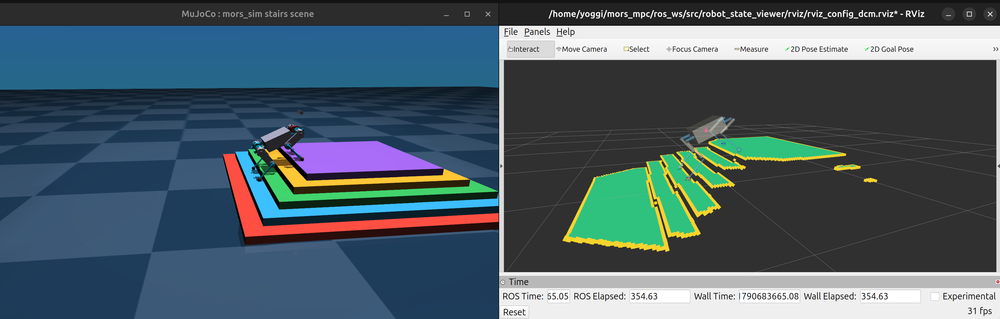
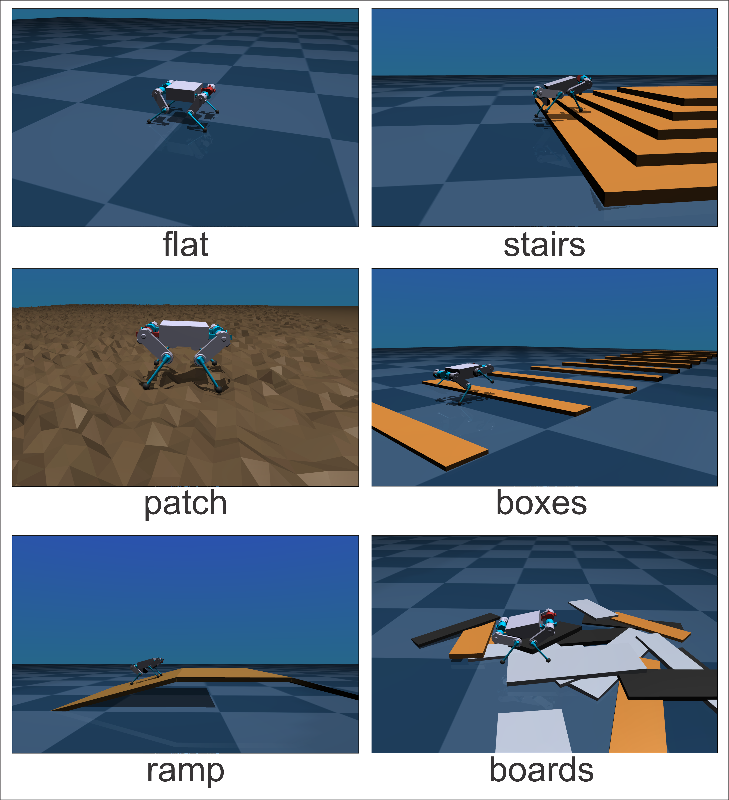

# MORS Quadruped Robot Control

Репозиторий содержит стек управления робособакой [МОРС](https://docs.voltbro.ru/mors/), использующий MPC/WBIC-контроллер и построитель карты высот на основе технического зрения. Для симуляции используется [MuJoCo](https://mujoco.org/). Задавать команды можно через ROS 2-интерфейс.



Видеодемонстрация работы WBIC+MPC: [https://youtu.be/28EshOERJ94](https://youtu.be/28EshOERJ94?si=7QsEtfh_oUpAAv3s)

Алгоритм управления основан на следующих публикациях:

- Di Carlo, Jared, et al. "Dynamic locomotion in the mit cheetah 3 through convex model-predictive control." 2018 IEEE/RSJ international conference on intelligent robots and systems (IROS). IEEE, 2018. [Link](https://dspace.mit.edu/handle/1721.1/138000)

- Kim, Donghyun, et al. "Highly dynamic quadruped locomotion via whole-body impulse control and model predictive control." arXiv preprint arXiv:1909.06586, 2019. [Link](https://arxiv.org/abs/1909.06586)

- Kim, Donghyun et al. “Vision Aided Dynamic Exploration of Unstructured Terrain with a Small-Scale Quadruped Robot.” 2020 IEEE International Conference on Robotics and Automation (ICRA) (2020): 2464-2470. [Link](https://dspace.mit.edu/entities/publication/580c4721-a611-4d73-8b53-53a58434aebf)


## Требования

- Ubuntu 24.x
- [ROS 2 Jazzy Desktop](https://docs.ros.org/en/jazzy/index.html) (`/opt/ros/jazzy`)
- `sudo` доступ

## Быстрый старт

### Установка

```bash
cd ~
git clone https://github.com/voltdog/mors_quadruped.git
cd mors_quadruped
chmod +x install.sh run.sh
./install.sh
source ~/.bashrc
```

### Запуск

Запуск симулятора вместе с контроллером шагания:

```bash
./run.sh --sim
```

Запуск вместе с логгером:

```bash
./run.sh --sim --log
```

Запуск с визуализацией карты высот в rviz:

```bash
./run.sh --sim --rviz
```

После запуска обязательно дождитесь вывода в консоль:
```
[LocomotionController]: Started
```

После этого введите во втором терминале:

```bash
ros2 run mors_keyboard_control mors_keyboard_control
```

Rviz-конфиг для визуализации карты высот находится в `ros_ws/src/robot_state_viewer/rviz/rviz_config.rviz`.

## Управление с клавиатуры

Основные клавиши:

- `Enter` - встать / лечь.
- `Space` - переключение `STANDING_MODE` / `LOCOMOTION_MODE`.
- `W/S` - движение вперед/назад.
- `Q/E` - движение влево/вправо.
- `A/D` - поворот.
- `1..9` - максимальная скорость от `0.1` до `0.9`.
- `Arrow Up/Down` - изменение высоты корпуса.
- `Ctrl + Arrow Up/Down` - изменение времени переноса ноги.
- `Shift + Arrow Up/Down` - изменение высоты шага.

## Просмотр логов

Если вы используете ключ `--log` при запуске робота, то во время выполнения программы включается модуль `MorsLogger` и начинает постоянную запись данных из всех LCM-каналов в CSV-файлы в папку `~/mors_logs`. Запись автоматически останавливается через 120 секунд.
Для просмотра графиков удобно пользоваться [plotjuggler](https://github.com/facontidavide/PlotJuggler).

## Конфигурация

Все файлы конфигурации находятся в папке `config`.
Список основных файлов:
- Параметры контроллера локомоции (MPC, WBIC, swing-контроллер, планировщик походки) - `locomotion_controller.yaml`
- Параметры симуляции - `simulation.yaml`
- Физические параметры робота и максимально/минимально допустимые углы суставов - `robot.yaml`
- Параметры датчиков (датчики контакта, RealSense T265 и D435i) - `sensors.yaml`

Остальные файлы конфигурации изменять не рекомендуется.

Путь к конфигам задается переменной `CONFIGPATH` (ее автоматически настраивает `install.sh`).

## Выбор алгоритма управления

Алгоритм управления задается параметром `algorithm` в файле `config/locomotion_controller.yaml`:

- `wbic` - MPC + WBIC без технического зрения (слепая локомоция).
- `vision` - MPC + WBIC с картой высот от `HeightMapBuilder`: точки постановки стоп корректируются по высоте рельефа и смещаются на пригодные для опоры ячейки.

## Качество рендеринга

Доступны два режима качества рендеринга: `low` и `high`. По умолчанию используется `low`: в этом режиме отключены тени, отражения и skybox, что позволяет значительно повысить скорость симуляции на слабых машинах. Если у вас хорошая видеокарта и вы хотите видеть более качественную графику, переключитесь в режим `high`.

Качество рендеринга задается параметром `render_quality` в файле `config/simulation.yaml`. Значение `high` включает тени, отражения и skybox.

## Смена окружения робота

За тип окружения отвечает параметр `scene` в файле `config/simulation.yaml`. Вы можете выбрать следующие окружения:

- `flat`
- `stairs`
- `patch`
- `boxes`
- `ramp`
- `boards`
- `stumps`

Поэкспериментируйте с разными окружениями и параметрами движения с помощью горячих клавиш и посмотрите, как робот преодолевает различные препятствия.



## Структура проекта

```text
.
├── common
├── config
├── HeightMapBuilder
├── lcm_msgs
├── LocomotionController
├── MorsLogger
├── ros_ws/src/mors_keyboard_control
├── ros_ws/src/robot_mode_controller
├── ros_ws/src/mors_ros_msgs
├── ros_ws/src/robot_state_viewer
├── Simulator
├── run.sh
└── install.sh
```

## Что за что отвечает

- `common` - общие C++ типы, вспомогательные функции, модели ног и URDF.
- `config` - YAML-конфиги контроллера, симуляции, аварийных ограничений и каналов.
- `lcm_msgs` - `.lcm` описания сообщений и генерация [LCM](https://lcm-proj.github.io/lcm/)-типов (`lcm_gen.sh`).
- `HeightMapBuilder` - C++ построитель карты высот по данным камеры глубины (`height_map_builder`).
- `LocomotionController` - основной C++ контроллер, содержащий MPC и WBIC (`locomotionControllerMPC`).
- `MorsLogger` - C++ логгер телеметрии (`mors_logger`).
- `ros_ws/src/mors_ros_msgs` - ROS 2 интерфейсы (`GaitParams.msg`, `RobotCmd.srv`).
- `ros_ws/src/robot_mode_controller` - ROS 2 узел режимов/действий.
- `ros_ws/src/mors_keyboard_control` - ROS 2 узел управления с клавиатуры.
- `ros_ws/src/robot_state_viewer` - ROS 2 узел визуализации состояния робота и карты высот в rviz.
- `Simulator` - MuJoCo-симулятор с [LCM](https://lcm-proj.github.io/lcm/)-обменом.
- `run.sh` - сценарий запуска основных компонентов.
- `install.sh` - установка зависимостей, сборка и настройка окружения.

## Ручная пересборка (при необходимости)

```bash
cd lcm_msgs
bash lcm_gen.sh

source /opt/ros/jazzy/setup.bash
cd ../ros_ws
colcon build --symlink-install --packages-select mors_ros_msgs robot_mode_controller mors_keyboard_control robot_state_viewer
cd ..

cmake -S LocomotionController -B LocomotionController/build -DCMAKE_BUILD_TYPE=Release
cmake --build LocomotionController/build -j"$(nproc)"

cmake -S MorsLogger -B MorsLogger/build -DCMAKE_BUILD_TYPE=Release
cmake --build MorsLogger/build -j"$(nproc)"

cmake -S HeightMapBuilder -B HeightMapBuilder/build -DCMAKE_BUILD_TYPE=Release
cmake --build HeightMapBuilder/build -j"$(nproc)"
```

## Публикации

При использовании этой работы в академическом контексте, пожалуйста, сошлитесь на одну из следующих публикаций:

- Budanov V., Danilov V., Kapytov D., Klimov K. (2025). MORS: BLDC BASED SMALL SIZED QUADRUPED ROBOT. Journal of Computer and System Sciences International. no. 3, pp.152-176 DOI: 10.7868/S3034644425030146

- В. М. Буданов, В. А. Данилов, Д. В. Капытов, and К. В. Климов. Малогабаритный четырехногий шагающий робот на базе бесколлекторных моторов. Известия Российской академии наук. Теория и системы управления, (3):152–176, 2025.
